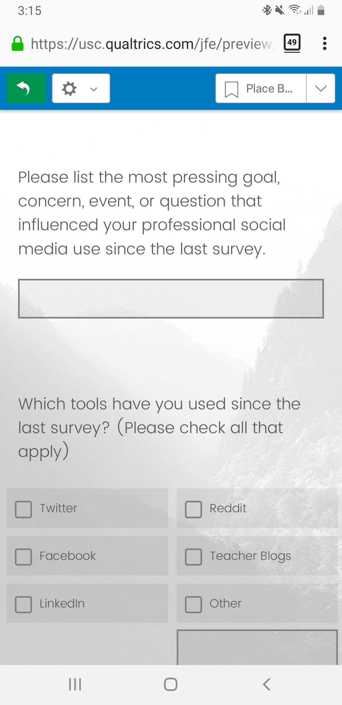

```{r, include=FALSE}
knitr::opts_chunk$set(echo = FALSE,
                      warning = FALSE,
                      tidy = FALSE,
                      message = FALSE,
                      fig.align = 'center',
                      out.width = "100%")
options(knitr.table.format = "html") 
```

# Introduction

The goal of this project is to investigate how sustained, individual interest develops from finer-grained experiences of situational interest that students have in introductory CS courses. This project will accomplish this goal using the experience sampling method (Hektner, Schmidt, & Csikszentmihalyi, 2007), which is a longitudinal research method that asks participants to report on their immediate experiences at many occasions. Prior research has not adequately investigated what drives individual differences in CS interest at the level at which policymakers and educators can most effectively act, namely, at a situation-to-situation level, rather than in terms of what happens in courses, programs of study, or occupations in general and overall. 

## Objectives

We are studying how students develop interest in Computer Science. 

To do this, we have developed a new SMS surveying tool called Short Message Survey, that we are using to conduct this study.

There are many different use cases for Short Message Survey, including

- Sending out a static survey link
- Experience sampling automated SMS based surveys  
- Fixed surveys
- Interventions

## Study Constructs

Our research project will explore how students’ initial interest, as well as their individual motivational characteristics, such as CS self-concept, and CS self-efficacy, relate to interest at a situation-to-situation level. Furthermore, we will also explore how contextual factors - those internal to students, such as how challenging they found the activities, as well as those external to students, such as the focus of each class - relate to students’ situational interest. Overall, we hope to better understand how students’ situational interest relates to changes in their longer-term, individual interest.

# Use Cases

## Static Survey Link

Short message survey can used to send out links to a web based survey via SMS message, many of which can then be directly completed in a mobile browser
<!--
{ width = 30% } { width = 30% }
-->
```{r out.width = "100%", fig.show='hold',fig.align='center'}
library(knitr)
library(png)
library(grid)
library(gridExtra)

comb2pngs <- function(imgs, bottom_text = NULL){
  img1 <-  grid::rasterGrob(as.raster(readPNG(imgs[1])),
                            interpolate = FALSE)
  img2 <-  grid::rasterGrob(as.raster(readPNG(imgs[2])),
                            interpolate = FALSE)
  grid.arrange(img1, img2, ncol = 2, bottom = bottom_text)
}
#include_graphics(c('images/static_link.jpg', 'images/browser_survey.jpg'))

png1_dest <- "images/static_link.png"
png2_dest <- "images/browser_survey.png"

comb2pngs(c(png1_dest, png2_dest))
```

## ESM Survey

Short message survey is especially useful for asking students ESM questions.

The ESM questions are initiated by a prompt SMS message, and completed by the student responding with SMS messages.

```{r out.width = "100%"}
#include_graphics('images/ESM_survey.jpg')
#include_graphics('images/ESM_survey_2.jpg')

png1_dest <- "images/ESM_survey.png"
png2_dest <- "images/ESM_survey_2.png"

comb2pngs(c(png1_dest, png2_dest))
```

<!--
To reference a citation you can add your `.bib` file to the working directory and name it in the YAML metadata or generate an automated one as done here, then you only need to reference the label value in the `.bib` file. For example this package is built on top of the wonderful {pagedown} package and I will cite it at the end of this sentance using this in the rmd `[@R-pagedown]` [@R-pagedown].

To get a better understanding of how to include features like these please refer to the {posterdown} [wiki](https://github.com/posterdown/wiki).

**_Now on to the results!_**

-->

## Interventions

Another use case for short message survey is SMS-based interventions.

Recent previous research in health has shown that SMS-based interventions can be effective in changing behavior (e.g. Guillory et al., 2015, Prestwich et al., 2010).

There is great potential for using such interventions in education, as SMS messages could be an effective platform to implement social-psych interventions that have shown potential in education (Yeager and Walton, 2011).

# Conclusions

We think that by using SMS, we are removing impediments to participants responding to our data collection prompts, we are getting the most direct access to students’ experiences, and we are minimizing the burden of the demands we are placing on students. All of these are important for an intensive research method like ESM which tends to ask a lot of participants, so we expect our data collection method to lead to better quality data on students’ experiences compared with typical ESM methods

<!--

Here you may have some figures to show off, bellow I have made a scatterplot with the infamous Iris dataset and I can even reference to the figure automatically like this, `Figure \@ref(fig:irisfigure)`, Figure \@ref(fig:irisfigure).

```{r, irisfigure, fig.cap='Here is a caption for the figure. This can be added by using the "fig.cap" option in the r code chunk options, see this [link](https://yihui.name/knitr/options/#plots) from the legend himself, [Yihui Xie](https://twitter.com/xieyihui).', out.width="80%"}
par(mar=c(2,2,0,1))
plot(x = iris$Sepal.Length, y = iris$Sepal.Width,
     col = iris$Species, pch = 19, xlab = "Sepal Length",
     ylab = "Sepal Width")
```

Maybe you want to show off some of that fancy code you spent so much time on to make that figure, well you can do that too! Just use the `echo=TRUE` option in the r code chunk options, Figure \@ref(fig:myprettycode)!

```{r myprettycode, echo=TRUE, fig.cap='Boxplots, so hot right now!', fig.height=6, out.width="80%"}
#trim whitespace
par(mar=c(2,2,0,0))
#plot boxplots
boxplot(iris$Sepal.Width~iris$Species,
        col = "#008080", 
        border = "#0b4545",
        ylab = "Sepal Width (cm)",
        xlab = "Species")
```

How about a neat table of data? See, Table \@ref(tab:iristable):

```{r, iristable}
knitr::kable(
  iris[1:15,1:5], format = "html",
  caption = "A table made with the **knitr::kable** function.",
  align = "c", col.names = c("Sepal <br> Length",
                             "Sepal <br> Width",
                             "Petal <br> Length",
                             "Petal <br> Width",
                             "Species"),
  escape = FALSE)
```


-->
# References

Guillory, J., Chang, P., Henderson Jr, C. R., Shengelia, R., Lama, S., Warmington, M., ... & Gay, G. (2015). Piloting a text message-based social support intervention for patients with chronic pain: establishing feasibility and preliminary efficacy. The Clinical journal of pain, 31(6), 548.

Hektner, J. M., Schmidt, J. A., & Csikszentmihalyi, M. (2007). Experience sampling method: Measuring the quality of everyday life. Sage.

Prestwich, A., Perugini, M., & Hurling, R. (2010). Can implementation intentions and text messages promote brisk walking? A randomized trial. Health psychology, 29(1), 40.

Yeager, D. S., & Walton, G. M. (2011). Social-psychological interventions in education: They’re not magic. Review of educational Research, 81(2), 267-301.