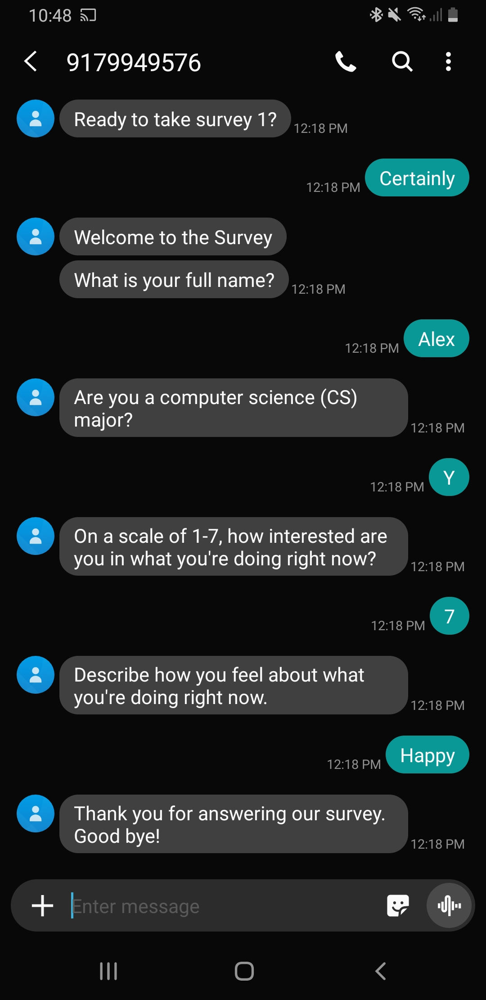
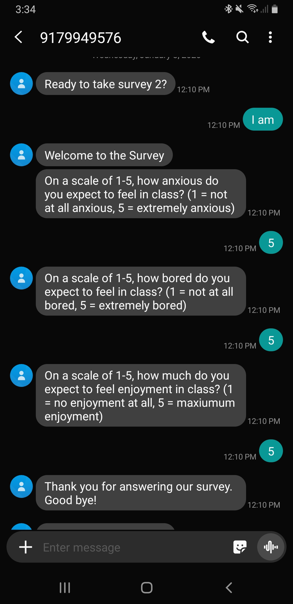

```{r, include=FALSE}
knitr::opts_chunk$set(echo = FALSE,
                      warning = FALSE,
                      tidy = FALSE,
                      message = FALSE,
                      fig.align = 'center',
                      out.width = "100%")
options(knitr.table.format = "html") 
```

# Introduction

The goal of this project is to investigate how sustained, individual interest develops from finer-grained experiences of situational interest that students have in introductory computer science (CS) courses. 

This project will accomplish this goal using the experience sampling method (ESM; Hektner, Schmidt, & Csikszentmihalyi, 2007), which is an "intensive" longitudinal research method that asks participants to report on their immediate experiences at many occasions. 

Past research has not adequately investigated what drives individual differences in CS interest at the level at which policymakers and educators can most effectively act—at a situation-to-situation level—rather than in terms of what happens in courses, programs of study overall. 

## Objectives

Our objective is to understand how students develop an interest in CS.

To do this, we have developed a new SMS-based survey tool called *Short Message Survey*.

There are many different use cases for *Short Message Survey*, including:

1. Sending out a static survey link
1. ESM surveys and surveys sent at fixed times
1. Interventions

## Study Constructs

Our research project will explore how students’ initial interest—as well as their individual motivational characteristics, such as CS self-concept, and CS self-efficacy—relate to interest at a situation-to-situation level. 

Furthermore, we will also explore how contextual factors—those internal to students, such as how challenging they found the activities, as well as those external to students, such as the focus of each class—relate to students’ situational interest.

Overall, we hope to better understand how students’ situational interest relates to changes in their longer-term, individual interest.

# Use Cases

## 1. Static Survey Link

*Short Message Survey* can be used to send out links to a web-based survey via SMS message many of which can then be directly completed in a mobile Internet browser.

```{r out.width = "100%", fig.show='hold',fig.align='center'}
library(knitr)
library(png)
library(grid)
library(gridExtra)

comb2pngs <- function(imgs, bottom_text = NULL){
  img1 <-  grid::rasterGrob(as.raster(readPNG(imgs[1])),
                            interpolate = FALSE)
  img2 <-  grid::rasterGrob(as.raster(readPNG(imgs[2])),
                            interpolate = FALSE)
  grid.arrange(img1, img2, ncol = 2, bottom = bottom_text)
}
#include_graphics(c('images/static_link.jpg', 'images/browser_survey.jpg'))

png1_dest <- "images/static_link.png"
png2_dest <- "images/browser_survey.png"

comb2pngs(c(png1_dest, png2_dest))
```

## 2. ESM Surveys and Surveys Sent at Fixed Times

*Short Message Survey* is especially useful for asking students ESM survey questions.

The ESM questions are initiated by a prompt SMS message, and completed by the student responding with SMS messages.

```{r out.width = "100%"}
#
#

png1_dest <- "images/ESM_survey.png"
png2_dest <- "images/ESM_survey_2.png"

comb2pngs(c(png1_dest, png2_dest))
```

## 3. Interventions

Another use case (in-development) for *Short Message Survey* is SMS-based interventions.

Recent previous research in health has shown that SMS-based interventions can be effective in changing behavior (e.g. Guillory et al., 2015.; Yeager & Walton, 2011).

# Conclusions

By using SMS, we are removing impediments to participants responding to our data collection prompts, we can more understand students’ experiences in a more valid way while aiming to reduce the burden of the demands placed on students (or teachers). These are important for an intensive longitudinal research method such as ESM (Hektner et al., 2007), which can be demanding of participants, and so we expect our data collection method to lead to better quality data on students’ experiences compared with typical ESM methods and to better illuminate students' pathways toward CS interests, majors, and careers.

# References

Guillory, J., Chang, P., Henderson Jr, C. R., Shengelia, R., Lama, S., Warmington, M., ... & Gay, G. (2015). Piloting a text message-based social support intervention for patients with chronic pain: establishing feasibility and preliminary efficacy. The *Clinical Journal of Pain, 31*(6), 548.

Hektner, J. M., Schmidt, J. A., & Csikszentmihalyi, M. (2007). *Experience sampling method: Measuring the quality of everyday life.* Sage.

Yeager, D. S., & Walton, G. M. (2011). Social-psychological interventions in education: They’re not magic. *Review of Educational Research, 81*(2), 267-301.

# Links

- http://www.shortmessagesurvey.com/
- http://picsul.utk.edu/

This material is based upon work supported by the National Science Foundation under Grant No. 1937700.