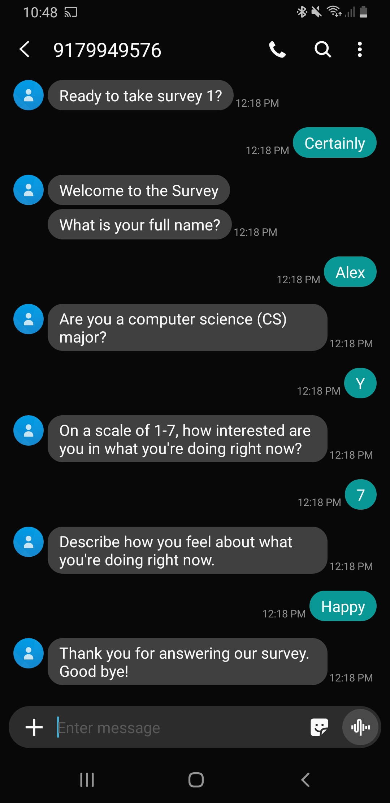

Objectives {.block}
================================================================================

We are studying how students develop interest in Computer Science. 

We want to tell you about our new SMS surveying tool called Short Message Survey, that we are using to conduct this study.

There are many different use cases, including

- Sending out a static survey link
- Experience sampling automated SMS based surveys  
- Fixed surveys
- Interventions

Static Survey
================================================================================

Short message survey can used to send out links to a web based survey via SMS message, many of which can then be directly completed in a mobile browser

```{r out.width = "40%", echo = FALSE}
library(knitr)
include_graphics('images/static_link.jpg')
include_graphics('images/browser_survey.jpg')
```

Study Context 
================================================================================

The goal of this project is to investigate how sustained, individual interest develops from finer-grained experiences of situational interest that students have in introductory CS courses. This project will accomplish this goal using the experience sampling method (Hektner, Schmidt, & Csikszentmihalyi, 2007), which is a longitudinal research method that asks participants to report on their immediate experiences at many occasions. Prior research has not adequately investigated what drives individual differences in CS interest at the level at which policymakers and educators can most effectively act, namely, at a situation-to-situation level, rather than in terms of what happens in courses, programs of study, or occupations in general and overall. 

Study Constructs
================================================================================

Our research project will explore how students’ initial interest, as well as their individual motivational characteristics, such as CS self-concept, and CS self-efficacy, relate to interest at a situation-to-situation level. Furthermore, we will also explore how contextual factors - those internal to students, such as how challenging they found the activities, as well as those external to students, such as the focus of each class - relate to students’ situational interest. Overall, we hope to better understand how students’ situational interest relates to changes in their longer-term, individual interest.

Important Result {.block}
================================================================================


Experience Sampling Method Surveys
================================================================================

Short message survey is especially useful for asking students ESM questions.

The ESM questions are initiated by a prompt SMS message, and completed by the student responding with SMS messages.


```{r out.width = "40%", echo = FALSE}

include_graphics('images/ESM_survey_2.jpg')
```

<!--
Nam quis odio enim, in molestie libero. Vivamus cursus mi at nulla elementum sollicitudin. Nam quis odio enim, in molestie libero. Vivamus cursus mi at nulla elementum sollicitudin.
  
\begin{equation}
E = mc^{2}
(\#eq:Einstein)
\end{equation}

Nam quis odio enim, in molestie libero. Vivamus cursus mi at nulla elementum sollicitudin. Nam quis odio enim, in molestie libero. Vivamus cursus mi at nulla elementum sollicitudin.

\begin{equation}
\cos^3 \theta =\frac{1}{4}\cos\theta+\frac{3}{4}\cos 3\theta
(\#eq:refname)
\end{equation}

Nam quis odio enim, in molestie libero. Vivamus cursus mi at nulla elementum sollicitudin. Nam quis odio enim, in molestie libero. Vivamus cursus mi at nulla elementum sollicitudin.

\begin{equation}
\kappa =\frac{\xi}{E_{\mathrm{max}}}
\end{equation}

Nam quis odio enim, in molestie libero. Vivamus cursus mi at nulla elementum sollicitudin. Nam quis odio enim, in molestie libero. Vivamus cursus mi at nulla elementum sollicitudin.


-->

Interventions
================================================================================

<!--
::: {.figure-example}
Placeholder  
~~~~~~~  
Image

Figure 2: Figure caption.
:::

Nunc tempus venenatis facilisis. Curabitur suscipit consequat eros non porttitor. Sed a massa dolor, id ornare enim:

```{r echo=FALSE}
knitr::kable(iris[1:5, 1:4], caption = 'Table caption.')
```
-->

Another use case for short message survey is SMS-based interventions.

Recent previous research in health has shown that SMS-based interventions can be effective in changing behavior (e.g. Guillory et al., 2015, Prestwich et al., 2010).

There is great potential for using such interventions in education, as SMS messages could be an effective platform to implement social-psych interventions that have shown potential in education (Yeager and Walton, 2011).


References
================================================================================

<div id="refs"></div>

Guillory, J., Chang, P., Henderson Jr, C. R., Shengelia, R., Lama, S., Warmington, M., ... & Gay, G. (2015). Piloting a text message-based social support intervention for patients with chronic pain: establishing feasibility and preliminary efficacy. The Clinical journal of pain, 31(6), 548.

Hektner, J. M., Schmidt, J. A., & Csikszentmihalyi, M. (2007). Experience sampling method: Measuring the quality of everyday life. Sage.

Prestwich, A., Perugini, M., & Hurling, R. (2010). Can implementation intentions and text messages promote brisk walking? A randomized trial. Health psychology, 29(1), 40.

Yeager, D. S., & Walton, G. M. (2011). Social-psychological interventions in education: They’re not magic. Review of educational Research, 81(2), 267-301.

Conclusion
================================================================================

We think that by using SMS, we are removing impediments to participants responding to our data collection prompts, we are getting the most direct access to students’ experiences, and we are minimizing the burden of the demands we are placing on students. All of these are important for an intensive research method like ESM which tends to ask a lot of participants, so we expect our data collection method to lead to better quality data on students’ experiences compared with typical ESM methods

<!--
Acknowledgements {data-color=red}
================================================================================

Nam mollis tristique neque eu luctus. Suspendisse rutrum congue nisi sed convallis. Aenean id neque dolor. Pellentesque habitant morbi tristique senectus et netus et malesuada fames ac turpis egestas.

::: {.logo-example}
Placeholder Logo

Placeholder Logo

Placeholder Logo
:::

Nam mollis tristique neque eu luctus. Suspendisse rutrum congue nisi sed convallis. Aenean id neque dolor. Pellentesque habitant morbi tristique senectus et netus et malesuada fames ac turpis egestas.


Contact Information {.block data-color=black data-border-color=orange data-background-color=white}
================================================================================

- Web: https://www.example.org/smithlab
- Email: john@example.org
- Phone: +1 (000) 111 1111

-->